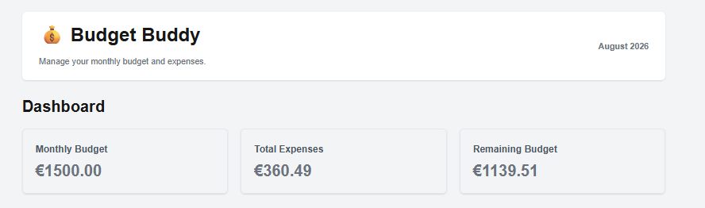
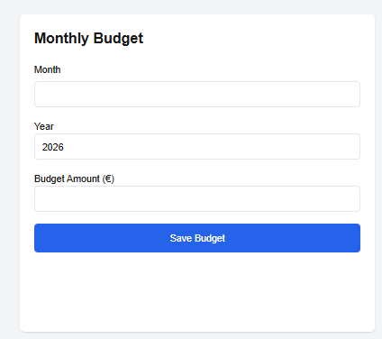
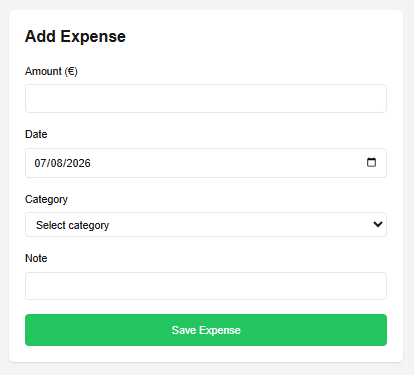
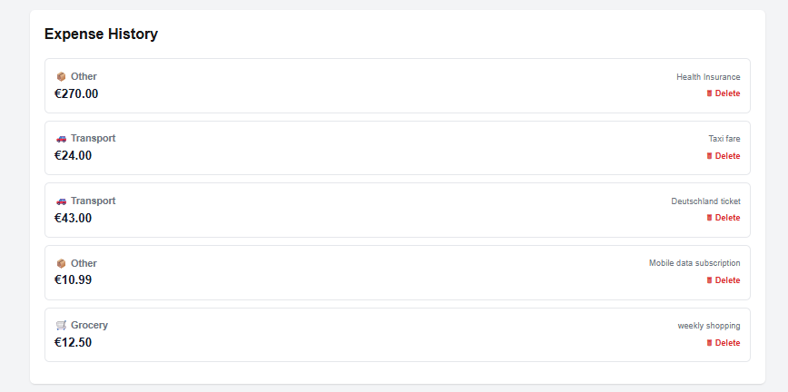

# 💰 Budget Buddy

A full-stack personal finance application for managing monthly budgets and tracking daily expenses.

Built as a hands-on software engineering and DevOps project to demonstrate full-stack development, REST API design, layered architecture, containerization, CI/CD, runtime validation, and incremental Agile delivery.

---

## Project Status

🟢 **Active Development**

**Current Milestone:** Sprint 11 — AWS Cloud Deployment Complete
**Current Version:** MVP 1.1

The project is developed incrementally using Agile methodology. Each sprint aims to deliver a complete, tested, and stable vertical slice.

---

## Project Overview

Budget Buddy allows users to:

- Create and update monthly budgets
- Record daily expenses
- Organize expenses by category
- View dashboard summaries
- Calculate remaining budget
- Review expense history
- Delete expenses
- Persist application data

The project also demonstrates the progression from application development to containerized delivery and automated runtime validation.

---

## Features

### Implemented

- Monthly budget management
- Expense tracking
- Expense categories
- Dashboard summary
- Remaining budget calculation
- Expense history
- Expense deletion
- SQLite persistence
- REST API
- Dockerized backend
- Dockerized frontend
- Docker Compose
- GitHub Actions CI
- Backend health validation
- Frontend availability validation
- Backend API smoke testing

### Planned

- Dashboard charts and analytics
- Edit existing expenses
- Expense filtering and search
- Monthly reports
- CSV/PDF export
- User authentication
- Cloud deployment
- Kubernetes deployment
- Monitoring and observability integration

---

## Technology Stack

### Frontend

- Next.js 15
- React 19
- JavaScript (ES6+)
- Tailwind CSS

### Backend

- Node.js
- Express.js

### Database

- SQLite
- SQLite3

### API

- RESTful API
- JSON

### DevOps

- Docker
- Docker Compose
- GitHub Actions
- Git / GitHub
- AWS EC2
- Docker Hub
- Cloud deployment
- Runtime validation

### Software Engineering

- Layered Architecture
- Separation of Concerns
- Single Responsibility Principle
- Component-Based Design
- Reusable UI Components
- Vertical Slice Development
- Agile Development
- Incremental Refactoring
- Continuous Validation
- Evidence-Based Debugging

---

## Architecture

Budget Buddy separates presentation, API/business logic, and persistence.

```text
                    Browser
                       │
                       ▼
              Next.js / React
                       │
                 REST / JSON
                       │
                       ▼
              Express.js API
                       │
              ┌────────┴────────┐
              │                 │
              ▼                 ▼
        Service Layer       Controllers
              │
              ▼
        SQLite Database
```

### Frontend

Responsible for:

- Rendering the user interface
- Managing component state
- Handling forms and user interactions
- Calling backend REST APIs
- Displaying dashboard and expense information

### Backend

Responsible for:

- HTTP request handling
- Routing
- Input validation
- Business logic
- Database communication
- JSON API responses
- Error handling

### Database

SQLite stores:

- Monthly budgets
- Expense records
- Expense categories

---

## Containerized Architecture

Docker Compose runs the application as two services:

```text
                 Docker Compose
                      │
          ┌───────────┴───────────┐
          │                       │
          ▼                       ▼
   Frontend :3000          Backend :5000
          │                       │
          └──── REST API ─────────┘
                                  │
                                  ▼
                             SQLite data
```

The frontend communicates with the backend using the Compose service name:

```text
http://backend:5000/api
```

The backend persists SQLite data through the configured host-mounted data directory.

---

## AWS Cloud Deployment

Sprint 11 deployed the Dockerized application to an AWS EC2 instance in the Frankfurt (`eu-central-1`) region.

```text
                         Internet
                            │
                 ┌──────────┴──────────┐
                 │                     │
                 ▼                     ▼
          Frontend :3000         Backend :5000
                 │                     │
                 └──── REST / JSON ────┘
                                       │
                                       ▼
                              SQLite on persistent
                              EC2 host storage
```

### Deployment

- AWS EC2 `t3.small`
- Ubuntu Server 24.04 LTS
- Docker Engine
- Docker Compose
- Docker Hub images
- Persistent SQLite data through an EC2 host-mounted volume
- Public frontend and backend access for this learning MVP

### Published Images

| Service | Image | Version |
|---|---|---|
| Backend | `jaydaniel10/budget-buddy-backend` | `1.1.1` |
| Frontend | `jaydaniel10/budget-buddy-frontend` | `1.1.2` |

The frontend `1.1.2` image contains the AWS API endpoint as a Next.js build-time environment value. The public IP is intentionally not stored in project documentation because EC2 public IP addresses can change.

### Deployment Validation

The deployed application was validated through:

```text
Container Runtime
      ↓
EC2 HTTP Validation
      ↓
External HTTP Validation
      ↓
Full-Stack Browser Workflow
      ↓
Persistence After Container Recreation
```

Verified:

- Backend `/api/health` returned `200 OK`
- Backend `/api/expense` returned `200 OK`
- Frontend returned `200 OK`
- Budget and expense creation worked through the browser
- Application data remained available after backend container recreation

### Docker Image Optimization

Production Dockerfiles were optimized using multi-stage builds and Next.js standalone output.

| Image | Before | After | Reduction |
|---|---:|---:|---:|
| Frontend | 1.31 GB | 381 MB | ~71% |
| Backend | 915 MB | 344 MB | ~62% |

The optimization reduced unnecessary build dependencies and production image content while preserving runtime functionality.

### Cloud Scope

Sprint 11 is intentionally a **Cloud Deployment MVP**, not a production AWS architecture.

**Included**

- EC2 deployment
- Docker-based runtime
- Docker Compose orchestration
- External HTTP validation
- Persistent application data
- Basic AWS architecture documentation
- Cost-aware operation and teardown

**Deferred**

- Load balancer
- Auto Scaling
- RDS migration
- Kubernetes
- Infrastructure as Code
- Advanced networking
- Production TLS/reverse proxy
- Advanced monitoring

---

## CI/CD Pipeline

GitHub Actions validates the application on pushes and pull requests targeting `main`.

The current pipeline follows:

```text
Git Push / Pull Request
          ↓
    GitHub Actions
          ↓
 Install Dependencies
          ↓
   Build Frontend
          ↓
 Build Docker Images
          ↓
 Start Docker Compose
          ↓
 Backend Health Check
          ↓
 Frontend Availability Check
          ↓
 Expense API Smoke Test
          ↓
 Failure Diagnostics
          ↓
 Compose Shutdown
```

### Validation layers

| Validation | Purpose |
|---|---|
| Frontend build | Confirms the production frontend can be built |
| Backend Docker build | Confirms the backend image can be created |
| Frontend Docker build | Confirms the frontend image can be created |
| Backend health check | Confirms the backend service is responding |
| Frontend availability check | Confirms the frontend is serving HTTP traffic |
| `GET /api/expense` smoke test | Confirms a real backend application operation responds |
| Compose logs on failure | Provides runtime diagnostics |
| Compose shutdown | Cleans up the CI environment |

### Engineering concept

A successful Docker image build does **not** prove that the application works at runtime.

The pipeline therefore validates progressively:

**Build → Start → Health → Availability → Application Behaviour → Cleanup**

This provides a basic CI runtime quality gate.

---

## API Smoke Test

The current smoke test uses the existing read-only endpoint:

```text
GET /api/expense
```

The endpoint returns the application's expense collection and was verified locally with an HTTP `200 OK` response.

The distinction between the checks is:

```text
/api/health
    ↓
"Is the backend service alive?"

/api/expense
    ↓
"Can the backend perform a real application operation?"
```

This is intentionally a lightweight smoke test rather than a full automated API test suite.

---

## Project Structure

```text
budget-buddy/

├── backend/
│   ├── src/
│   │   ├── controllers/
│   │   ├── database/
│   │   ├── models/
│   │   ├── routes/
│   │   ├── services/
│   │   └── app.js
│   └── server.js
│
├── frontend/
│   ├── src/
│   │   ├── app/
│   │   ├── components/
│   │   └── services/
│   └── public/
│
├── docs/
├── k8s/                         # Planned
├── docker-compose.yml
├── .github/
│   └── workflows/
│       └── ci.yml
└── README.md
```

---

## Installation

### Prerequisites

- Git
- Node.js 20+
- Docker
- Docker Compose

### Quick Start

```bash
git clone https://github.com/jacksonitoro/budget-buddy.git
cd budget-buddy
docker compose up --build
```

Frontend:

```text
http://localhost:3000
```

Backend:

```text
http://localhost:5000
```

Health check:

```text
http://localhost:5000/api/health
```

---

## Verification

Check the running services:

```bash
docker compose ps
```

Verify backend health:

```bash
curl -i http://localhost:5000/api/health
```

Verify frontend availability:

```bash
curl -I http://localhost:3000
```

Verify the expense API:

```bash
curl -i http://localhost:5000/api/expense
```

Expected application-level result:

```text
HTTP/1.1 200 OK
```

---

## Project Roadmap

| Sprint | Objective | Status |
|---|---|:---:|
| Sprint 1 | Backend Foundation | ✅ |
| Sprint 2 | REST API Development | ✅ |
| Sprint 3 | Frontend Foundation | ✅ |
| Sprint 4 | Frontend Integration | ✅ |
| Sprint 5 | Professional User Interface | ✅ |
| Sprint 6 | Frontend Architecture & Reusable Components | ✅ |
| Sprint 7 | Professional Documentation | ✅ |
| Sprint 8 | Docker & Docker Compose | ✅ |
| Sprint 9 | Expense Deletion & Full-Stack Integration | ✅ |
| Sprint 10 | GitHub Actions CI/CD & Runtime Validation | ✅ |
| Sprint 11 | AWS Cloud Deployment | ✅ |
| Sprint 12 | Kubernetes | ⏳ |
| Sprint 13 | Monitoring & Observability | ⏳ |

---

## Engineering Milestones

### Sprint 8 — Containerization

- Dockerized backend
- Dockerized frontend
- Docker Compose orchestration
- Persistent SQLite storage

### Sprint 9 — Full-Stack Integration

- Added expense deletion
- Integrated frontend and backend changes
- Performed regression validation
- Validated persistence after container restart

### Sprint 10 — CI/CD & Runtime Validation

- Added GitHub Actions CI workflow
- Automated frontend production build
- Automated backend validation
- Automated Docker image builds
- Started Docker Compose in CI
- Added backend health validation
- Added frontend availability validation
- Added backend API smoke testing
- Added failure diagnostics using Compose logs
- Automated Compose cleanup
- Verified successful CI execution

### Sprint 11 — AWS Cloud Deployment

- Deployed Budget Buddy to AWS EC2
- Installed and validated Docker Engine and Docker Compose
- Published production images to Docker Hub
- Optimized backend and frontend production images
- Deployed the application with Docker Compose
- Validated external frontend and backend access
- Validated backend health and API behaviour
- Verified full-stack browser functionality
- Verified SQLite persistence after container recreation
- Documented cloud architecture and deployment scope

---

## Software Engineering Process

Budget Buddy follows an iterative Agile workflow:

```text
Vision
  ↓
Architecture
  ↓
Sprint Planning
  ↓
Vertical Slice Development
  ↓
Review
  ↓
Refactor
  ↓
Validation
  ↓
Commit
  ↓
Push
  ↓
Retrospective
```

Each milestone is validated before moving to the next phase.

---

## Engineering Principles

The project applies:

- Architecture Before Features
- Separation of Concerns
- Single Responsibility Principle
- Layered Architecture
- Component Reusability
- Vertical Slice Development
- Incremental Development
- Continuous Validation
- Evidence-Based Debugging
- Stable Milestone Commits
- Continuous Improvement

---

## Git Workflow

Development uses feature branches for significant changes.

```text
main
 │
 ├── feature/backend-foundation
 ├── feature/fullstack-foundation
 ├── feature/docker
 ├── feature/ci-cd
 └── feature/kubernetes
```

Completed work is:

**Implemented → Tested → Reviewed → Committed → Pushed**

Stable milestones are kept reproducible before the next feature is introduced.

---

## Learning Outcomes

### Software Engineering

- Requirements analysis
- Software architecture
- Layered architecture
- Separation of concerns
- REST API design
- Agile development
- Sprint planning
- Vertical slice development
- Incremental refactoring
- Git workflow
- Evidence-based debugging

### Frontend

- Next.js App Router
- React components
- React hooks
- Component communication
- Reusable UI components
- Responsive layout
- Tailwind CSS

### Backend

- Express.js
- REST API routing
- Controllers
- Services
- Models
- Input validation
- Database integration
- JSON communication
- Error handling

### Database

- SQLite
- Database design
- CRUD operations
- Persistent application data

### DevOps

- Docker
- Docker Compose
- GitHub Actions
- CI/CD pipeline design
- Docker image validation
- Runtime service validation
- HTTP health checks
- API smoke testing
- Failure diagnostics
- Automated environment cleanup
- AWS EC2 deployment
- Docker image publishing
- Cloud runtime validation
- Persistent container data
- Basic cloud cost awareness

---

## Current DevOps Learning Path

The project is intentionally progressing from application engineering toward platform engineering:

```text
Full-Stack Application
        ↓
REST API
        ↓
Docker
        ↓
Docker Compose
        ↓
CI/CD
        ↓
Runtime Validation
        ↓
Cloud Deployment
        ↓
Kubernetes
        ↓
Monitoring & Observability
```

Each stage builds on the previous one rather than introducing infrastructure without an application context.

---

## Application Preview

### Dashboard



Monthly budget, total expenses, and remaining budget.

### Set Monthly Budget



Create or update the monthly budget.

### Add Expense



Record expenses with category, amount, date, and note.

### Expense History



View recorded expenses and perform deletion.

---


The objective is to demonstrate not only that the application works, but that it can be **built, validated, containerized, automated, deployed, monitored, and operated** through an incremental engineering process.

itoro@Jackson MINGW64 /c/Dev/budget-buddy (main)
$
